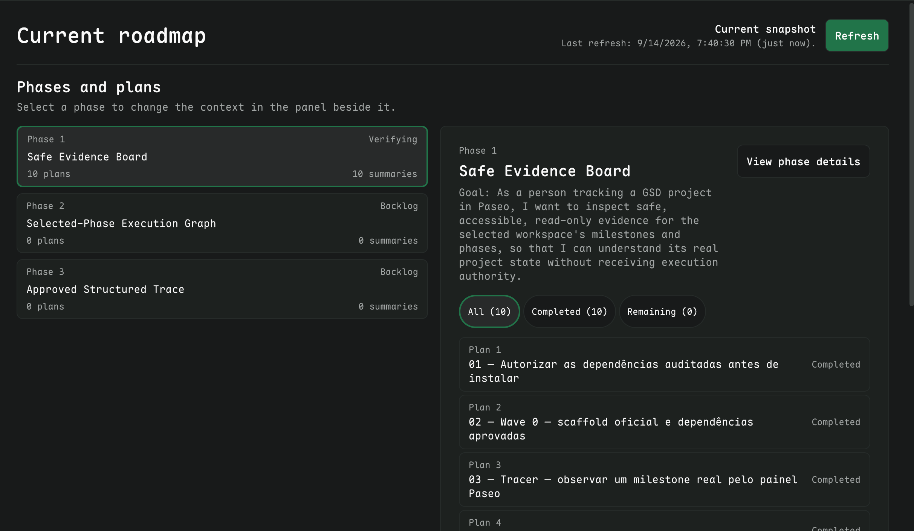
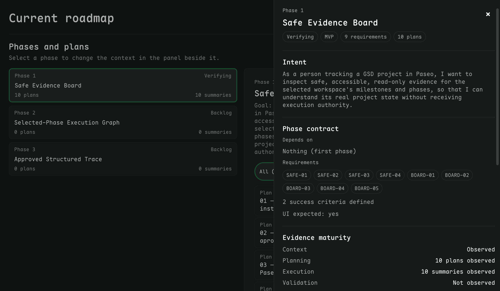
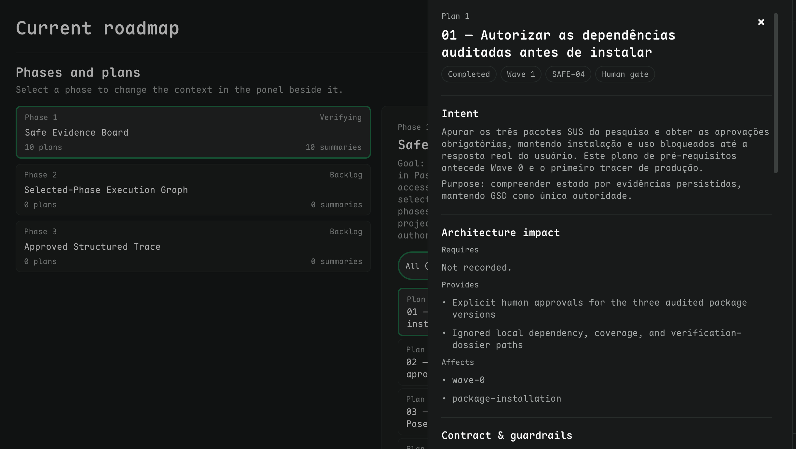

# Paseo GSD Observer

A read-only Paseo plugin for understanding the persisted state of a GSD project. It turns the selected workspace's planning evidence into an accessible board of milestones, phases, and plans—without running GSD, creating worktrees, merging code, or declaring work complete.

## Phase 1: Safe Evidence Board

This public release contains the Safe Evidence Board. It lets you:

- Browse the current roadmap and safely observed archived milestones.
- Read phase status, plan and summary counts, and evidence limitations without treating missing data as success or failure.
- Select a phase, inspect its plans, and open focused phase or plan details.
- Refresh evidence explicitly; filesystem changes only mark the view as potentially stale.

The board is an observer, not a control surface. It contains no terminal, agent, lifecycle, merge, cleanup, or write action.

## Screenshots

### Roadmap board



### Phase details



### Plan details



## Requirements

- Paseo plugin support compatible with the manifest range: `>=0.8.0 <0.9.0`.
- Node.js and this repository's dependencies installed with `npm ci`.
- An open, selected workspace containing GSD planning artifacts.

## Install locally

Clone this repository, install dependencies, then point Paseo at the absolute checkout path:

```sh
git clone <repository-url> paseo-gsd-observer
cd paseo-gsd-observer
npm ci
paseo plugin install "$(pwd)"
```

Open a GSD workspace in Paseo and select **Open GSD Board** from its workspace panels. The plugin receives only the host-selected workspace ID; it never accepts a filesystem path from the client.

## Trust and safety boundary

All filesystem access stays in the Paseo server process. Before reading, the plugin resolves the selected workspace through Paseo, follows real paths, enforces containment under the real `.planning` root, and reads only a fixed allowlist of artifacts.

- Individual artifact reads are capped at **256 KiB**; a snapshot has a **4 MiB** total budget.
- Symlinks, file replacement, oversized input, malformed content, unknown formats, and paths outside the trusted root become explicit warnings or unavailable evidence.
- The client receives validated IDs, labels, counts, warnings, and evidence categories—not raw artifact bodies, paths, logs, prompts, arguments, tokens, or secrets.
- Completion is shown only when allowlisted evidence establishes it. The observer never infers lifecycle state from a process, log, timestamp, or absent file.

The plugin adds no HTTP service, database, telemetry, terminal, agent action, or write access to GSD artifacts.

## Development

```sh
npm ci
npm run typecheck
npm test -- --run
```

The Vitest suite covers RPC boundaries, restricted decoders, path containment, snapshots, watcher behavior, and panel flows using a fake host. It complements, but does not replace, validation in a rendered Paseo host.

## Scope

The public repository intentionally contains only the plugin source, tests, and user-facing documentation. Local GSD planning state, agent instructions, and verification dossiers are excluded.
