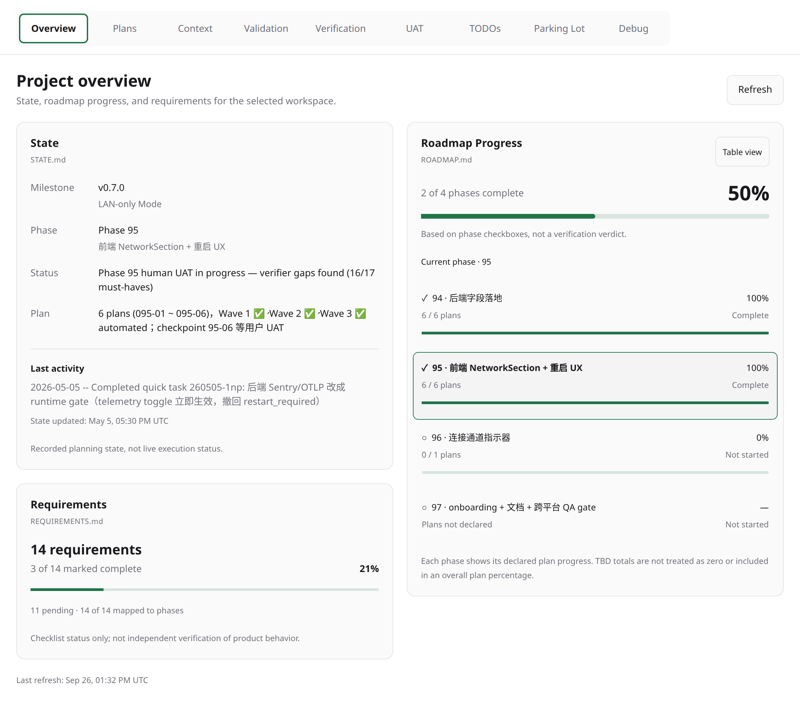
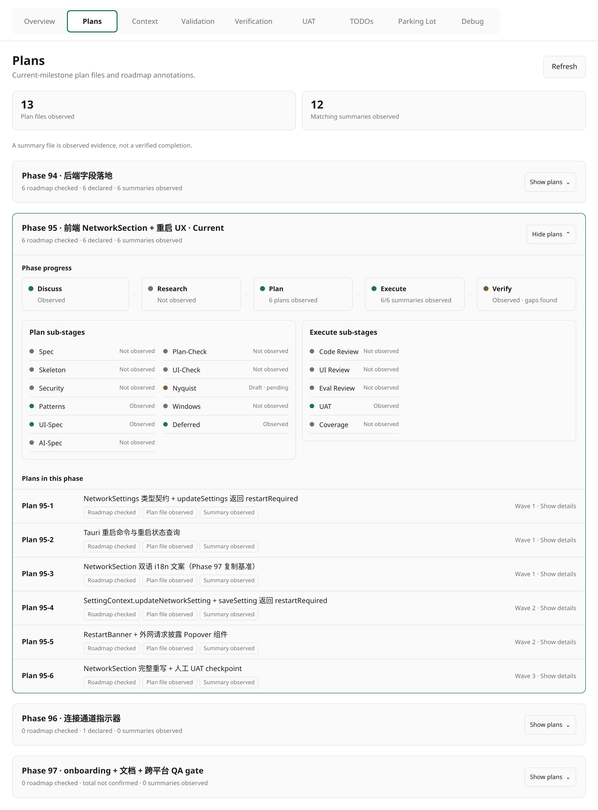
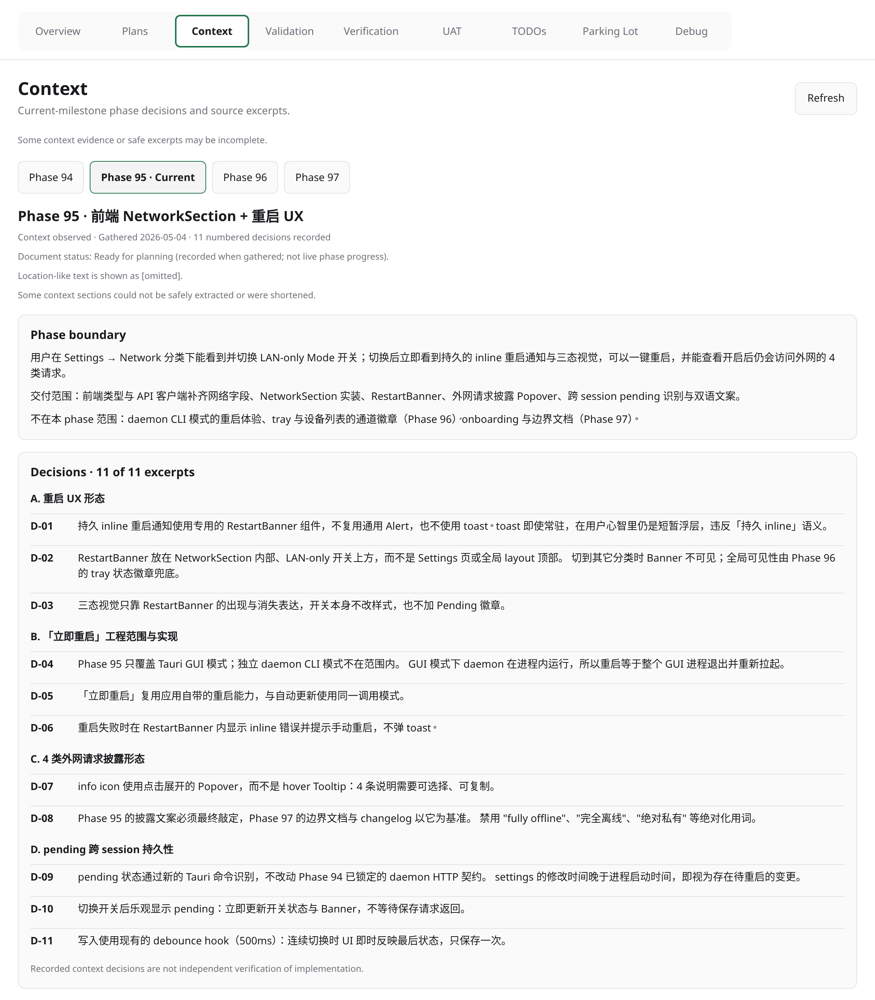
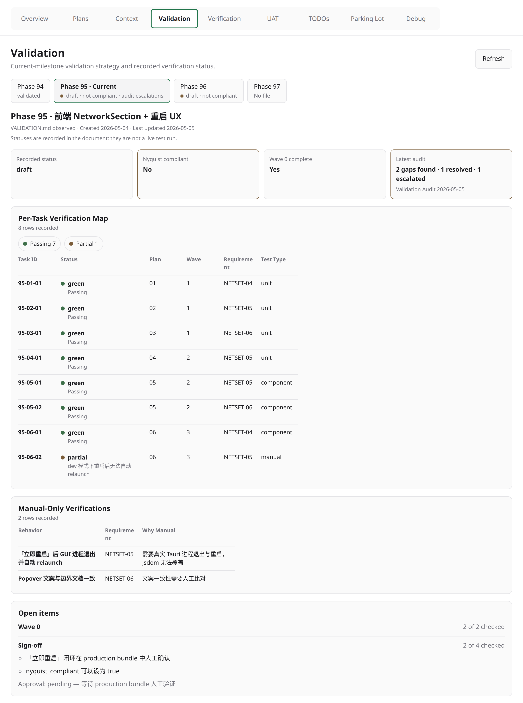
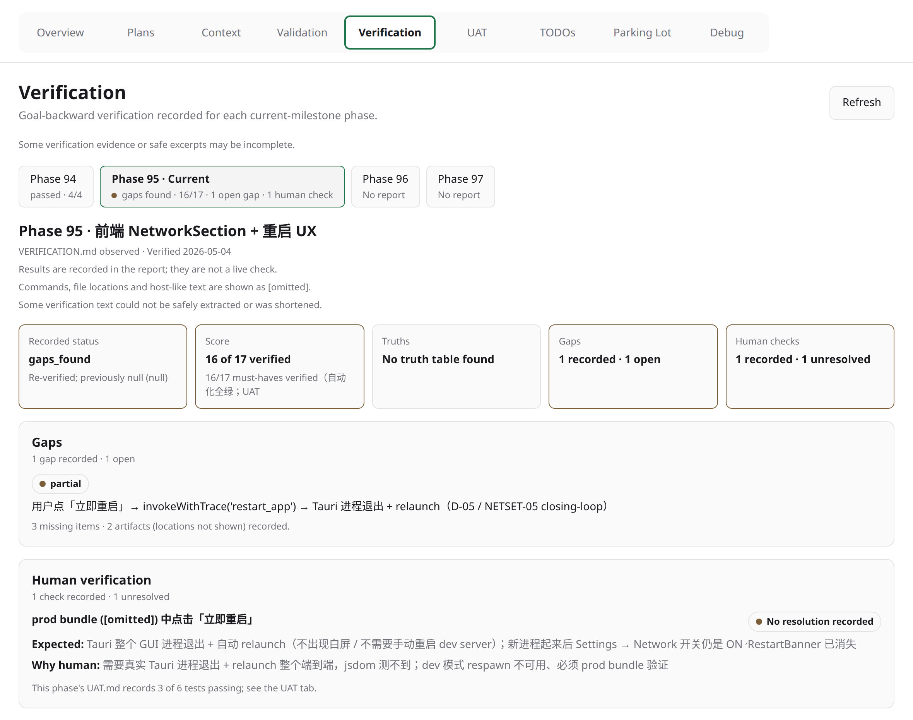
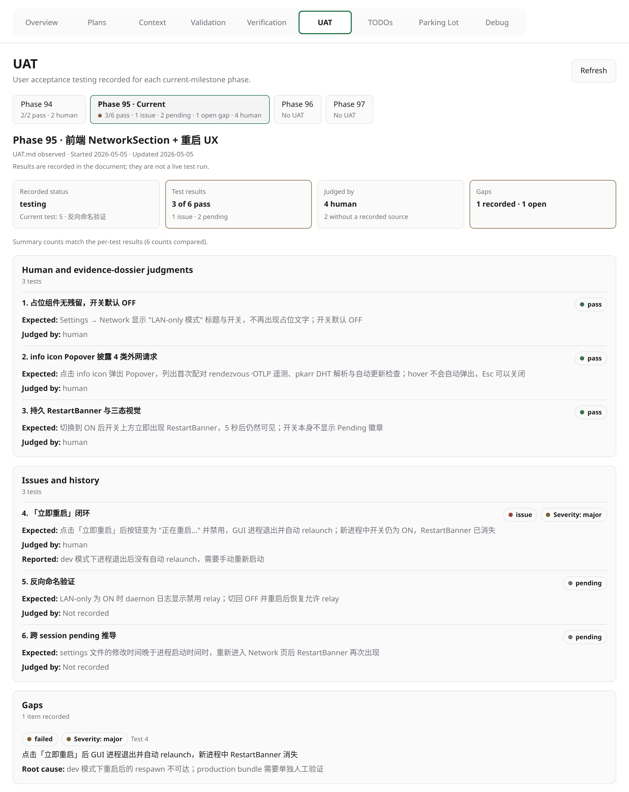
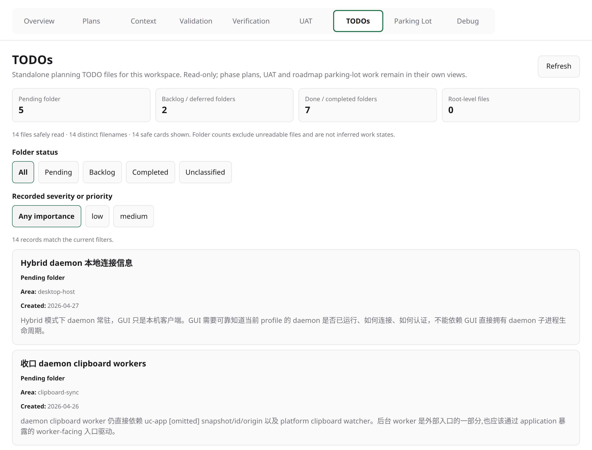
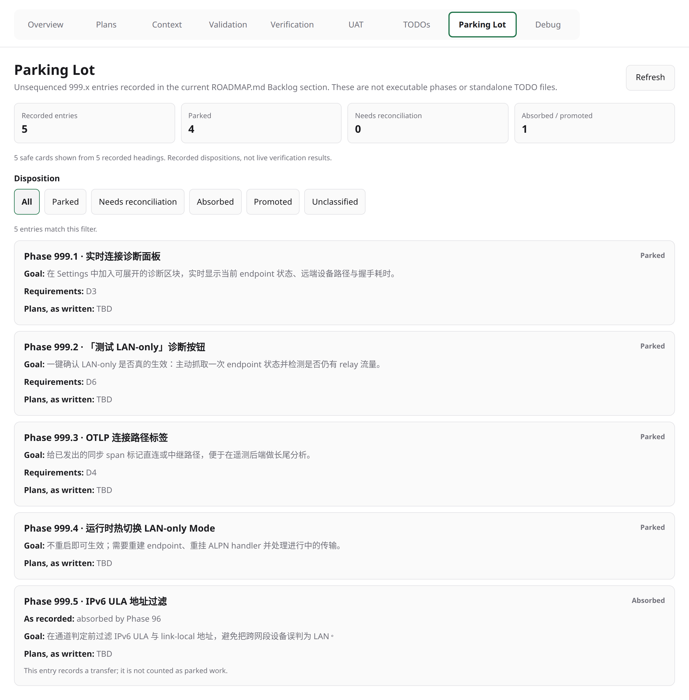
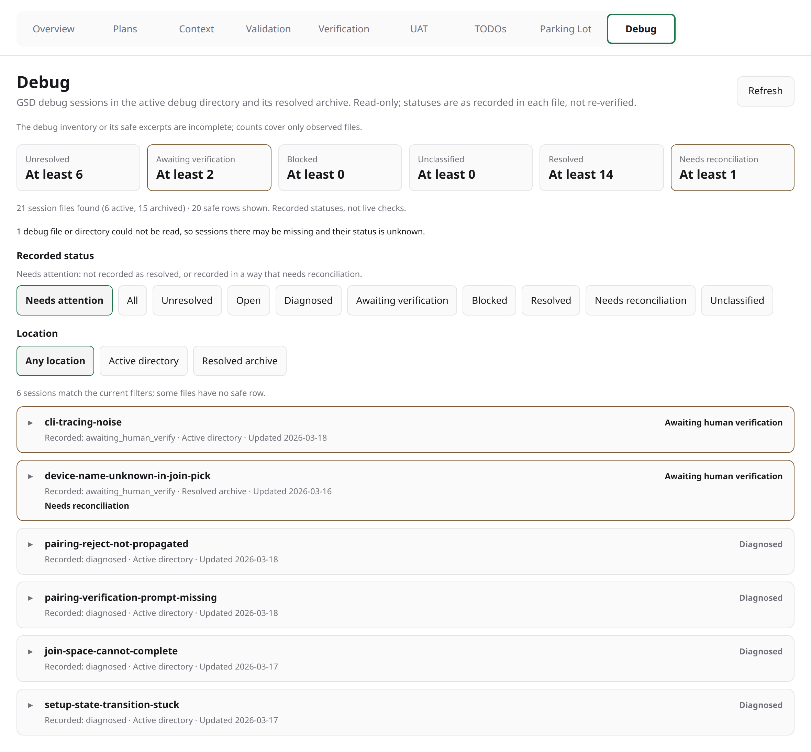

# Paseo GSD Observer

A read-only Paseo plugin for understanding the persisted state of a GSD project. It turns the selected workspace's current planning evidence into accessible, read-only tabs—without running GSD, creating worktrees, merging code, or declaring work complete.



Screenshots show a copy of the public [UniClipboard](https://github.com/UniClipboard/UniClipboard) project's planning, adapted for this showcase: some files were renamed or reformatted to GSD conventions, and the validation, UAT, parking-lot, and backlog TODO entries are illustrative. Project text appears in its original language.

## What it shows

The board is a set of read-only tabs over the selected workspace's current planning evidence:

- **Overview**: STATE, roadmap progress, and requirements.
- **Plans**: current-milestone phases with their plans, summaries, and phase checks.
- **Context**: decisions and boundaries recorded in each phase's CONTEXT.
- **Validation**: per-phase validation maps and Nyquist status.
- **Verification**: per-phase verification reports, truths, and human checks.
- **UAT**: per-phase user acceptance tests and their recorded results.
- **TODOs**: standalone TODO files across pending, backlog, and completed folders.
- **Parking Lot**: unsequenced 999.x entries in the roadmap Backlog.
- **Debug**: GSD debug sessions in the active debug directory and its resolved archive.

Statuses are shown as recorded, and disagreements between sources are flagged rather than resolved. Refresh evidence explicitly; filesystem changes only mark the view as potentially stale.

| Plans | Context |
| --- | --- |
|  |  |
| **Validation** | **Verification** |
|  |  |
| **UAT** | **TODOs** |
|  |  |
| **Parking Lot** | **Debug** |
|  |  |

The board is an observer, not a control surface. It contains no terminal, agent, lifecycle, merge, cleanup, or write action.

## Requirements

- Paseo plugin support compatible with the manifest range: `>=0.9.0`.
- Node.js and this repository's dependencies installed with `npm ci`.
- An open, selected workspace containing GSD planning artifacts.

## Install locally

Clone this repository, install dependencies, then point Paseo at the absolute checkout path:

```sh
git clone <repository-url> paseo-gsd-observer
cd paseo-gsd-observer
npm ci
paseo plugin install "$(pwd)"
```

Open a GSD workspace in Paseo and select **Open GSD Board** from its workspace panels. The plugin receives only the host-selected workspace ID; it never accepts a filesystem path from the client.

## Trust and safety boundary

All filesystem access stays in the Paseo server process. Before reading, the plugin resolves the selected workspace through Paseo, follows real paths, enforces containment under the real `.planning` root, and reads only a fixed allowlist of artifacts.

- Individual artifact reads are capped at **256 KiB**; a snapshot has an **8 MiB** budget for planning evidence plus a separate **3 MiB** budget for debug sessions.
- Symlinks, file replacement, oversized input, malformed content, unknown formats, and paths outside the trusted root become explicit warnings or unavailable evidence.
- The client receives validated IDs, labels, counts, warnings, and evidence categories—not raw artifact bodies, paths, logs, prompts, arguments, tokens, or secrets.
- Completion is shown only when allowlisted evidence establishes it. The observer never infers lifecycle state from a process, log, timestamp, or absent file.

The plugin adds no HTTP service, database, telemetry, terminal, agent action, or write access to GSD artifacts.

## Development

```sh
npm ci
npm run typecheck
npm test -- --run
```

The Vitest suite covers RPC boundaries, restricted decoders, path containment, snapshots, watcher behavior, and panel flows using a fake host. It complements, but does not replace, validation in a rendered Paseo host.

## Limitations

The plugin requires a selected workspace with GSD planning artifacts. It presents only evidence it can safely read; absent, malformed, oversized, or inaccessible artifacts remain explicit warnings or unavailable states.

## Scope

The public repository intentionally contains only the plugin source, tests, and user-facing documentation. Local GSD planning state, agent instructions, and verification dossiers are excluded.
